# Opal Kelly Experiment

This markdown logs down my learning curve for the board of opal kelly and also evetually how to do the chip measurement after.

I will take a different route as Steve and use python to do most of the backend/frontend.

The whole system works by the following logic:

```
+--------------------------------------------------+
|                      PC                          |
|--------------------------------------------------|
|  Python / C++ / MATLAB / GUI Application         |
|                                                  |
|  FrontPanel API                                  |
+-----------------------+--------------------------+
                        |
                        | USB cable
                        v
+--------------------------------------------------+
|              Opal Kelly FPGA Board               |
|--------------------------------------------------|
|                                                  |
|   +------------------------------------------+   |
|   | USB Host Interface Chip                  |   |
|   | (managed by Opal Kelly firmware)         |   |
|   +------------------+-----------------------+   |
|                      |                           |
|                okUH / okHU                      |
|                      |                           |
|   +------------------------------------------+   |
|   | FPGA                                      |  |
|   |------------------------------------------|  |
|   |                                          |  |
|   |  okHost                                  |  |
|   |                                          |  |
|   |  okWireIn                                |  |
|   |  okWireOut                               |  |
|   |  okTriggerIn                             |  |
|   |  okTriggerOut                            |  |
|   |  okPipeIn                                |  |
|   |  okPipeOut                               |  |
|   |                                          |  |
|   |  Your Custom Logic                       |  |
|   |  - LEDs                                  |  |
|   |  - FSMs                                  |  |
|   |  - DSP                                   |  |
|   |  - LVDS                                  |  |
|   |  - Compression Engine                    |  |
|   +------------------------------------------+   |
+--------------------------------------------------+
```


## First ever hello world project

**Date: 11 May 2026**


I will try to do a very simple hello world project using python script.

The hardware implemented in the FPGA will simply be a NAND gate, which takes 2 inputs from WireIn and output NAND result to LED.

This will be encapsulated at the top moudle with 2 okWireIn and 1 okHost.

The module looks like below:

```verilog
module Top(

// Front panel USB interface
    input   [4:0] okUH,  // USB to host
    output  [2:0] okHU,  // host back to USB
    inout   [31:0] okUHU, // host and USB's data exchange
    inout           okAA, 
    
    
    output  led // output of our LED

    );
    
    wire WireInA, WireInB;
    
    wire [112:0] okHostEP;
    wire [31:0] ep00wire;
    wire [31:0] ep01wire;
    
    
    wire okClk;
    
    
    assign WireInA = ep00wire[0];
    assign WireInB = ep01wire[0];
    
    okHost  okHOSTTOP
    (
    .okUH(okUH),
    .okHU(okHU),
    .okUHU(okUHU),
    .okAA(okAA),
    .okClk(okClk),
    .okHE(okHostEP)
    
    );
    
    
    
    okWireIn    EP00 (.okHE(okHostEP),                             .ep_addr(8'h00), .ep_dataout(ep00wire));
    okWireIn    EP01 (.okHE(okHostEP),                             .ep_addr(8'h01), .ep_dataout(ep01wire));
    
    // wire [65*2-1:0]  okEHx;
    // okWireOR # (.N(2)) wireOR (okEH, okEHx);
    // okWireOut    ep20 (.okHE(okHE), .okEH(okEHx[ 0*65 +: 65 ]), .ep_addr(8'h20), .ep_datain(ep20wire));
    // okWireOut    ep21 (.okHE(okHE), .okEH(okEHx[ 1*65 +: 65 ]), .ep_addr(8'h21), .ep_datain(ep21wire));
    
    
    NAND_2x1 simple_nand(
        .A(WireInA),
        .B(WireInB), 
        .O(led)
    );
    
    
    
endmodule

```


I then implemneted the logic above in vivado and then wrote a simple python script.

```python
import ok


## Create Front Panel object
dev = ok.okCFrontPanel()

# Open first detected device
if dev.OpenBySerial("") != 0:
    print("Failed to open device")
    exit()

print("Device opened")

# Configure FPGA (optional if already configured)
dev.ConfigureFPGA("Top.bit")

print("LED ON")

# Turn LED ON
dev.SetWireInValue(0x00, 0x0001)
dev.SetWireInValue( 0x01, 0x0001)

# Push WireIns into FPGA
dev.UpdateWireIns()

print("LED now should be off")

input("Press Enter to turn LED BACK ON...")

# Turn LED OFF
dev.SetWireInValue(0x00, 0x0000)
dev.UpdateWireIns()

print("LED should be back ON")

```


I then turned on the python debug mode to programme the FPGA board. The breakpoints were set at the following lines:

```python
# Turn LED ON
dev.SetWireInValue(0x00, 0x0001)

...


print("LED now should be off")

input("Press Enter to turn LED BACK ON...")

```

So at the first breakpoint, the board should have been programmed, and then by default, the LED should be ON.

Given that NAND's input A = 0, B = 0 --> O = 1, which should light up the LED.

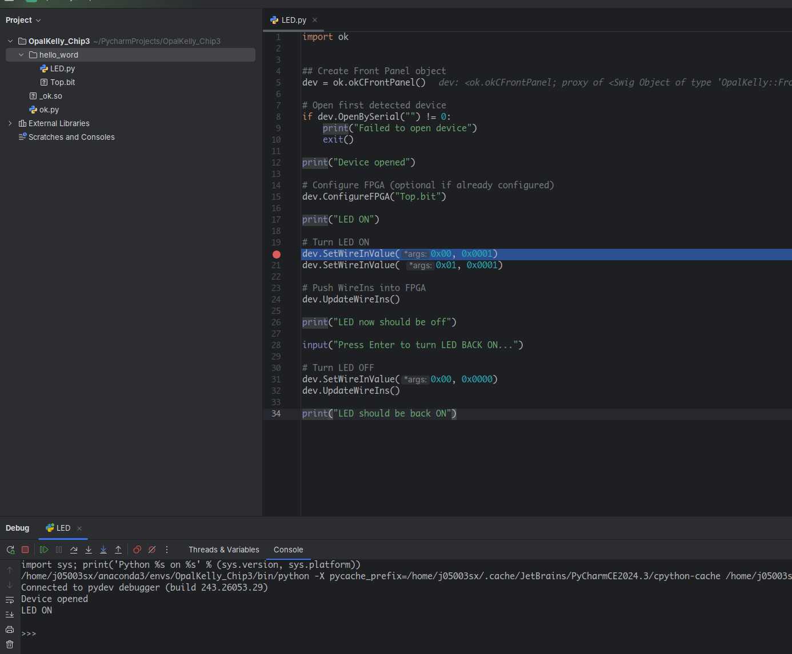

However, the board is showing something different to the expectation with the LED

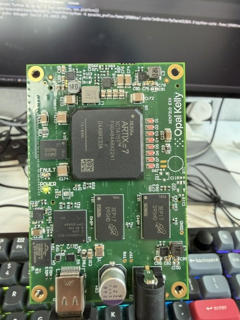

Then at the next breakpoint, both inputs have been set as 1, A = 1, B = 1 --> O = 0, which should turn off the LED.

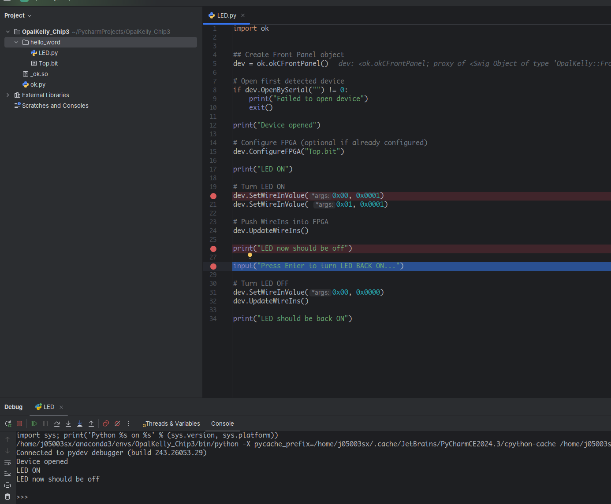

But the board is showing that the LED is turned ON.

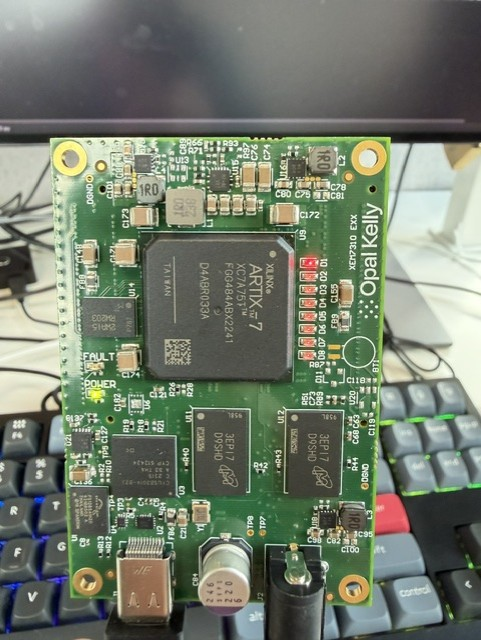 

So, in a way I have implemented the inverted logic, then I found that the correct LED drive should be a tristate assignment in the example.

```verilog
function [7:0] xem7310_led;
input [7:0] a;
integer i;
begin
    for(i=0; i<8; i=i+1) begin: u
        xem7310_led[i] = (a[i]==1'b1) ? (1'b0) : (1'bz);
    end
end
endfunction
```

So I should add an inverted logic with high-impedance to it.

Updating verilog now...

Okay, it is fixed now.


## PyQt6 GUI

**Date: 12-13 May 2026**

I then explored the possibility of having something similar to fonrtpanel's own profile interpretation.

Then I found the GUI package PyQt6 where everything can be configured as widgets and stacked in the window.

After a whole day of digging into this package, I now managed to recreate the firt FrontPanel SDK example.

This example can be found [here](https://docs.opalkelly.com/fpsdk/samples-and-tools/sample-first/).

But it seems that it has been taken down yesterday by OpalKelly.

To demonstrate, it looks something like this:

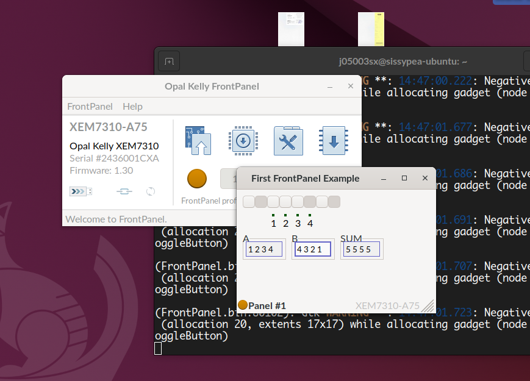

Where it has 8 buttons on the top, each would control a single LED separately.

Then followed by 4 LED display which is connected to a fixed value (in this case 0000).

Then it takes 2 16-bit numbers to do a simple addition and return the final sum.

All of these can be replicated using PyQt6 and opal kelly python package.

And it looks like this:

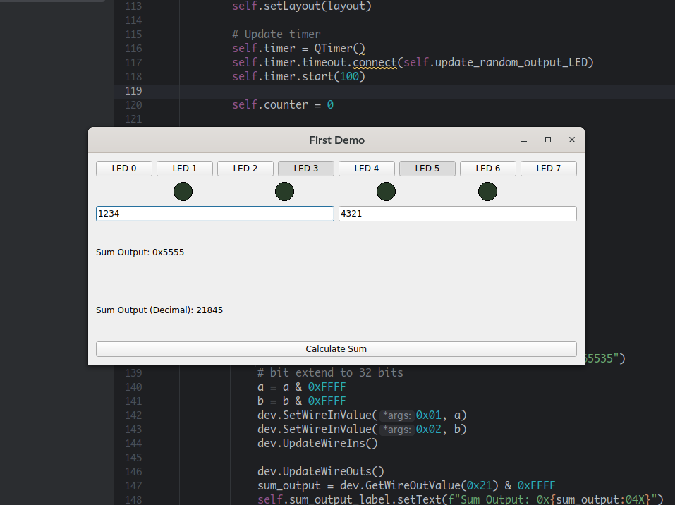

Probably the next step for Opal Kelly board experiment should be the inclusion of triggerIn/Out and PipeIn/Out.

I will try to design a very simple design to verify this.


## TriggerIn/Out and PipeIn/Out

**Date: 13 May 2026 ~**

Okay... it seems that opal kelly has dropped the new FrontPanel 6.0 and it has made changes to its python script about how it works.

Now I am reading its migration guide...

The biggest change so far is that it replaces all the wire trigger pipe and register calls.

These will be different with the code below:

```python


## Wires call are different now

# FP5:
   xem.SetWireInValue(0x00, value, mask)
   xem.UpdateWireIns()
   xem.UpdateWireOuts()
   out = xem.GetWireOutValue(0x20)

   # FP6:
   classic_data_port.SetWireInValue(0x00, value, mask)
   classic_data_port.UpdateWireIns()
   classic_data_port.UpdateWireOuts()
   out = classic_data_port.GetWireOutValue(0x20)


## Triggers are different
# FP5:
   xem.ActivateTriggerIn(0x40, 0)
   xem.UpdateTriggerOuts()
   if xem.IsTriggered(0x60, 1):
       ...

   # FP6:
   classic_data_port.ActivateTriggerIn(0x40, 0)
   classic_data_port.UpdateTriggerOuts()
   if classic_data_port.IsTriggered(0x60, 1):


## Pipes

 # FP5:
   xem.WriteToPipeIn(0x80, data)
   xem.ReadFromPipeOut(0xA0, data)
   xem.WriteToBlockPipeIn(0x80, blockSize, data)
   xem.ReadFromBlockPipeOut(0xA0, blockSize, data)

   # FP6:
   classic_data_port.WriteToPipeIn(0x80, data)
   classic_data_port.ReadFromPipeOut(0xA0, data)
   classic_data_port.WriteToBlockPipeIn(0x80, blockSize, data)
   classic_data_port.ReadFromBlockPipeOut(0xA0, blockSize, data)


## Registers

# FP5:
   value = xem.ReadRegister(addr)
   xem.WriteRegister(addr, data)

   # FP6:
   value = classic_data_port.ReadRegister(addr)
   classic_data_port.WriteRegister(addr, data)


## Reset FPGA

# FP5:
   xem.ResetFPGA()

   # FP6:
   classic_data_port.ResetFPGA()
```

I will have to stay with classic API for now...

But it would also mean that I probably do not have any where to refer to for API information.


## Chip3 overall Schematics

I will now organise what we have put on Chip3 so that we can design the test with Opal Kelly.

The following things will be included for at least my side of the chip:
+ Schematics
+ Chip pin order/name
+ Breakout on the PCB board <--> FPGA pin out


What I have put on the chip is basically a PLL configurator and PLL.


Pin out:

```

                  SDO  PLL_NMSX_SEL    <Corner>
                                        
                                        TCKO
                                        GNDK
                                        PLL_VCC18A
                                        PLL_VCC18D
                                        PLL_GND18A
                                        PLL_GND18D
                                        VCCK
                                        PLL_PDN
                                        FRANGE
                                        PLL_TEST

SDI PLL_NMSX_TCK    SE   PLL_FREF_TCKI <Corner>
```

PLL_config's verilog is very simple 

```
module PLL_config (

    input cfg_clk, // slow independent clock, I am expecting it to run at 10 MHz (100 ns)
    input PLL_NMSX_SEL, //SEL signal to mux to choose between default N/M or self customised N/M
    input SDI, // shift data in
    input SE, // shift enable
    input rst_n, // reset signal

    output SDO, // shift data out
    output [5:0] NSX, // final NSX output
    output [5:0] MSX  // final MSX output
    
);


reg [5:0] NS_SREG;
reg [5:0] MS_SREG;

always @(posedge cfg_clk or negedge rst_n)
begin
    if (!rst_n)
    begin 
        {NS_SREG, MS_SREG} <= 12'd0;    
    end
    else 
    begin 
        if(SE)
        begin 
            {NS_SREG, MS_SREG} <= {NS_SREG[4:0], MS_SREG, SDI};
        end
    end

end

assign SDO = NS_SREG[5];

assign {NSX, MSX} = PLL_NMSX_SEL? {NS_SREG, MS_SREG}: 12'b001111_000001; // this is either customised N/M or 15/1
```


**19 May 2026**

From the PCB board schematics Steve left me, I found the Pin-out to the chip.


```txt
----------- OUTPUT FROM FPGA --> INPUT TO CHIP -----------
B34_L21P -->  LVDS_ser_data_ctrl ====>      V9 
B34_L19P -->  clk_LVDS           ====>      V7  
B34_L23P -->  ctrlB              ====>      Y8
B34_L15P -->  clk_config         ====>      W6  (SC)
B34_L13P -->  data0              ====>      R4  (SC)
B34_L11P -->  samphold           ====>      Y4  (SC)
B34_L18P -->  NMSX_TCK           ====>      Y6 
B34_L22P -->  SDI                ====>      AA8 
B34_L6P  -->  PLL_test           ====>      U3 
B34_L5P  -->  SE                 ====>      W1 
B34_L5N  -->  PLL_PDN            ====>      Y1 
B34_L8N  -->  PLL_FREF_TCK       ====>      AB2 
B13_L5N  -->  FRANGE             ====>      AA14 
B13_L3N  -->  NMSX_SEL           ====>      AB13 

----------- INPUT FROM FPGA --> OUTPUT TO CHIP -----------
B13_L16P <--  TCKO              ====>      W15 
B13_L1N  <--  SDO               ====>      AA16 
B35_L19P <--  LVDS_P            ====>      N4 
B35_L19N <--  LVDS_N            ====>      N3 
```


And also this is what I designed for the counter 300M logic:

```verilog
`timescale 1ns/1ps
module CNT_300M (
    input clk_300m, 
    input rst_n,
    input [1:0] LVDS_SEL,

    output reg D_2_LVDS

    
);


reg [1:0] cnter;

always @(posedge clk_300m or negedge rst_n) begin : proc_cnter
    if(~rst_n) begin
        cnter <= 0;
    end else begin
        cnter <= cnter +1;
    end
end

always @(LVDS_SEL, cnter, clk_300m)
begin
    case (LVDS_SEL)
    2'b00: D_2_LVDS = clk_300m;
    2'b01: D_2_LVDS = cnter[0];
    2'b10: D_2_LVDS = cnter[1];
    2'b11: D_2_LVDS = cnter[0]||cnter[1];
        default : D_2_LVDS = 0;
    endcase
end


endmodule
```

Steve's Config scan chain looks something like:

```txt

on the pump of clk_LVDS, flops are chained up with the following:

data_LVDS --> ctrlA --> EN --> RS --> rst_n --> LVDS_set<1> --> LVDS_set<0> --> rst_n_pll
```

I should make a top level schematics based on my understanding.


## 20 May 2026

Here are the complete pin out for chip3:

```
<CornerTL>    VCCA   VCCD   OutP  OutN   GNDA   GNDD   BG   VCCK   GNDO   VCC3O   SDO  PLL_NMSX_SEL  <CornerTR>
data_LVDS                                                                                               TCKO
clk_LVDS                                                                                                VCCK
VCCK                                                                                                    
GNDK                                                                                                 PLL_VCC18A 
ctrlB                                                                                                PLL_VCC18D
VCC3O                                                                                                PLL_GND18A
GNDO                                                                                                 PLL_GND18D   
extres                                                                                                
VCCK                                                                                                 VCCK
clk_LVDS                                                                                             PLL_PDN                
GNDK                                                                                                 FRANGE
srd                                                                                                  PLL_TEST
<CornerLL>    SH  Pw_out centre_pow lpowen LPF GNDK centre vddpow SDI PLL_NMSX_TCK SE PLL_FREF_TCKI <CornerLR>
```

I also also now ploted out the schematic for the testable of our chip3.

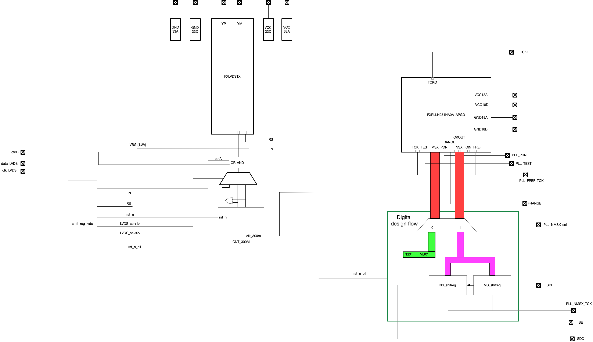

I will now start looking at the opal kelly board design, and try to at least make the scan chain work.


## 21 May 2026

From the PCB prints and schematics, it looks that the power and ground has been sorted by the board.

So I do not have to consider about that but simply how to drive and observe the actual signal.

To start with, I would like to simply just test the scan chain.

I have now finished the hardware design, with the following address information added for the hardware:

```text

############## WireIn endpoint 0x00 ###############

[11:0] -->  PARA_FEED
[12]   -->  PARAIN_EN
[13]   -->  OK_SCAN_IN
[14]   -->  rstn_ok
[15]   -->  PLL_PDN
[16]   -->  PLL_TEST
[17]   -->  FRANGE
[18]   -->  PLL_NMSX_SEL
[19]   -->  LVDS_ser_data_ctrl
[20]   -->  ctrlB


############## WireOut endpoint 0x20 ###############

OK_LED_WIREOUT_EP  -->  [11:0]
SDO_from_chip      -->  [12]
OK_SCAN_OUT        -->  [13]


############## TriggerIn endpoint 0x40 ###############
# @ FPGA divided clock of 20MHZ

[0]   -->  OK_SCAN_ENABLE
[1]   -->  SE
```
The schematics for the developed hardware on OpalKelly for the first round test can be found below:

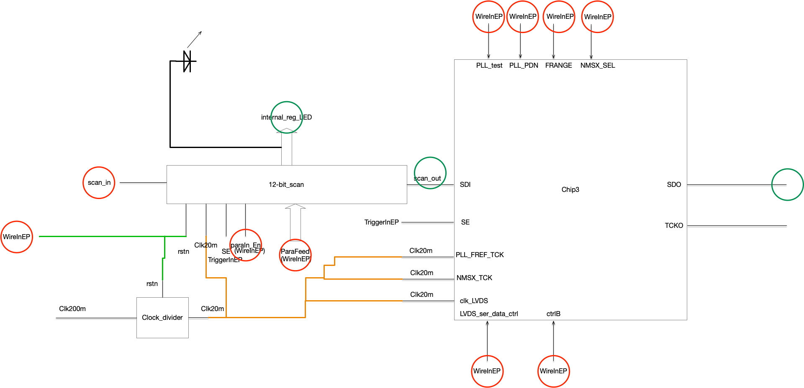

I will now proceed to develop a simple python script to test the hardware implementation first.


## 22 May 2026

I implemented a simple script to test the implemented circuit on the opal kelly board, and built a quick GUI interface based on it.

But it appears that the "set scan in high" button and "scan chain shift" did not work properly.


### Symptoms

By default all the LED will be lit and reset works fine.

when scan in set high is pressed after reset, it will lit up the last 3 LEDs and when de-asserted, the last 2 LEDs will be lit.

Scan chain shift does not work at all.

### Diagnose

I decided to build the text box to display what is the actual WireIn values.

Because all 10 signals were twisted into the same 32-bit word, it can be easily mistaken.

Then I realised that in the set_scan_in method, I set the wrong wire in value:

when scan_in needs to be set 1, I did:

```python
 dev.SetWireInValue(0x00, 0x1FE00)  # [11:0] = 00, [15:12] = 1110 = E, [20:16] = 11111 = 1F
```

which produces 4-bit less than needed value, which means Para_feed was set "0xE00", and parain_en = 1. This disabled the scan functionality for RTL on the FPGA.

Now it is fixed as below:

```python
 def set_scan_in(self):
        if self.scan_in_button.isChecked():
            ## only change the ok_scan_in bit to 1, keep other bits unchanged

            dev.SetWireInValue(0x00, 0x1FE000)  # [11:0] = 000, [15:12] = 1110 = E, [20:16] = 11111 = 1F
        else:
            ## only change the ok_scan_in bit to 0, keep other bits unchanged

            dev.SetWireInValue(0x00, 0x1FC000)  # [11:0] = 000, [15:12] = 1100 = C, [20:16] = 11111 = 1F
        dev.UpdateWireIns()
```

Now the behaviour is correct:

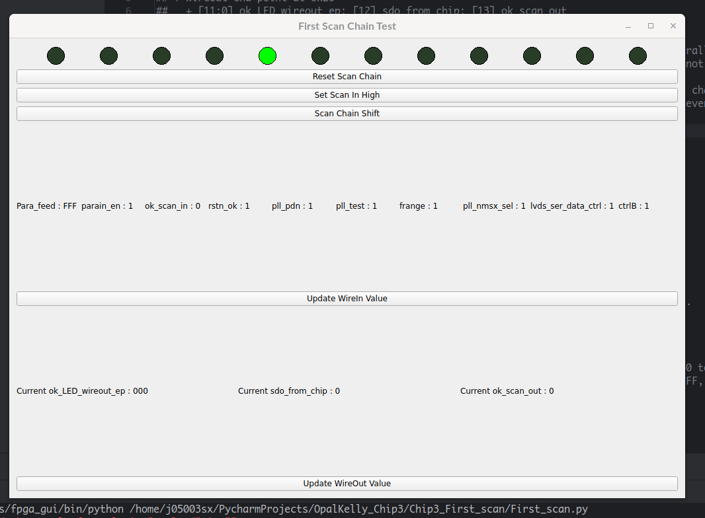

This also inspired me to probably implement individual buttons for needed WireIn instead.


## 26 May 2026

Long weekend, also high heat....

Will now add the buttons and a set box to set up the wire in values

Okay, now I have added textboxes and check boxes to programme the WireIn values.

But the update WireIn button needs to be clicked before these values are sent in.

Also I realised that the MSB LED has been placed on the right hand most and LSB has been placed on the left hand most, which is counter intuitive.

I have updated the LED arrangement to make it more readable as well.


## 27 May 2026

Now I want to do the proper testing in the lab, but the problem is that I could only carry my mac into the lab.

And FrontPanel has released their 6.0 version, which caused some changes on the python API.

So I decided to make a new branch and update all my code in this new branch in 6.0 feature.

Migration complete.

Now I can start the test by plugging FPGA and the PCB together.

And observe the chip socket through oscilloscope. 

Ok, I think I have just made the first step for chip measurement.

Thanks to the helpful test PCB design from Steve, I could easily observe the signal coming out of our FPGA pin.

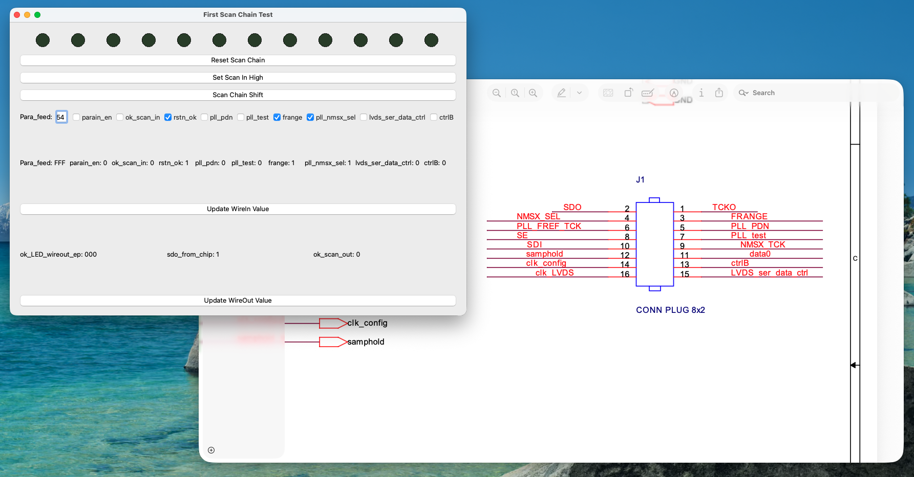

As the PCB schematic suggests, punch-hole of 6,9,16 should be driven by the same 20 MHz clock.

Combined with the actual PCB layout displayed below:

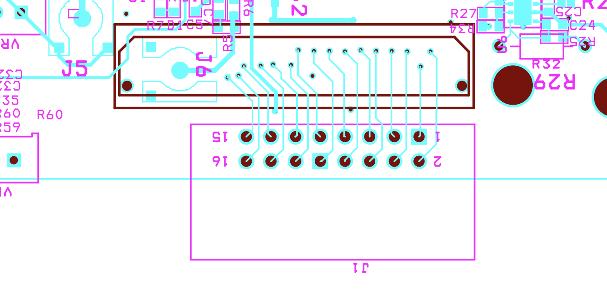

We could do preliminary test for it.

So I tested pin 16 of the connector, aka clk_LVDS.

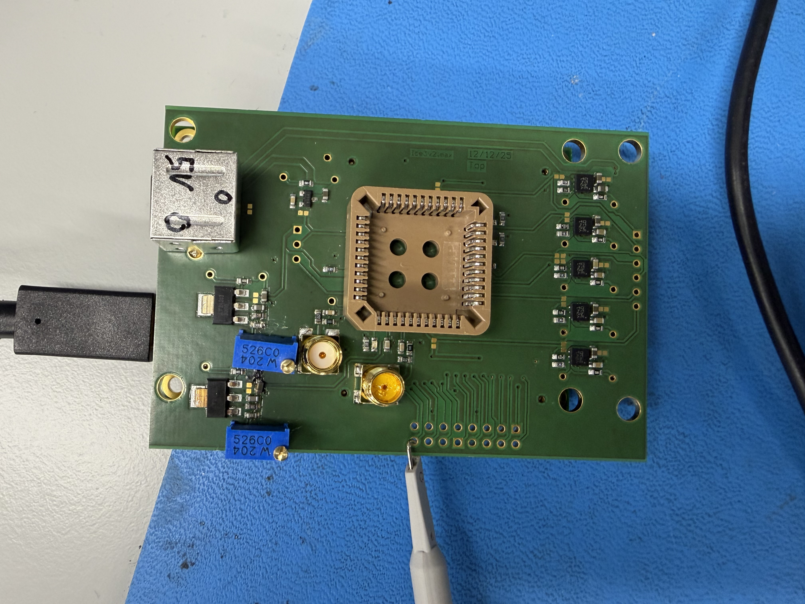

And correspondingly, 20MHz clock was observed from the scope


From the GUI I have set up for this test, it can be seen that FRANGE/NMSX_SEL has been set to 1, therefore, 3.3 V should be observed on punch-hole 3/4.

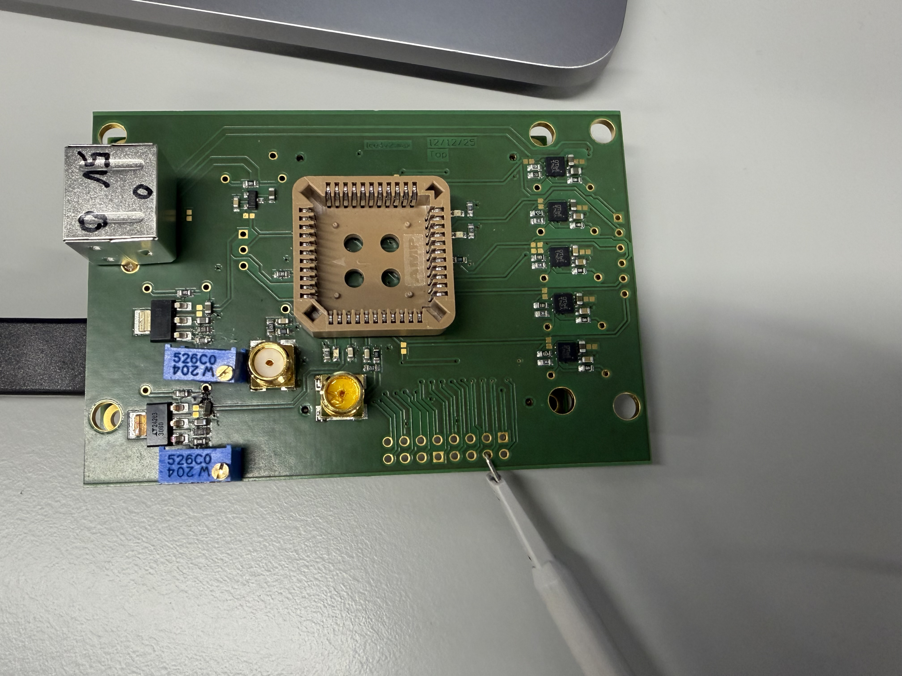

And I am very lucky that 3.3 V has been observed from the scope


This has been verified to be true when I turned it off on the GUI, then 0V was observed.


## 28 May 2026

Because there has been no record for the actual die-chip pin planning. 

I will have to do it myselt to check the intended chip-orientation.

Then after checking closely the actual chip. I see the 44 pins and what they are.

I have sort out the actual die and bonding wire planning.

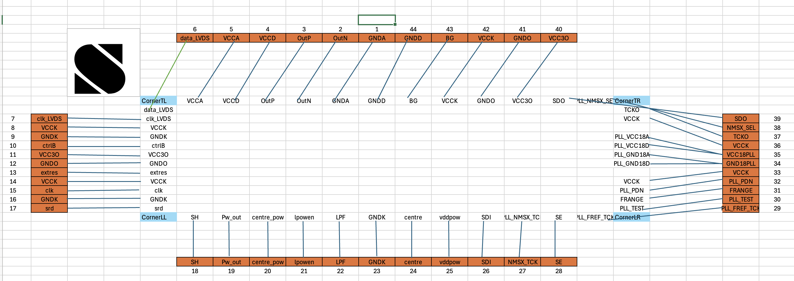

If we take the top side as the top side and according to the socket, the middle pin as the pin 1 and increment by counter clockwise. 

After some layout and shcematic checking with the pin number comparison, I found the correct chip orientation on the socket.

It appears that the chip should be rotated clockwise for 90 degrees so that the top left corner "S" should be near the input power connector.

The orientation can be illustrated with the depiction below:

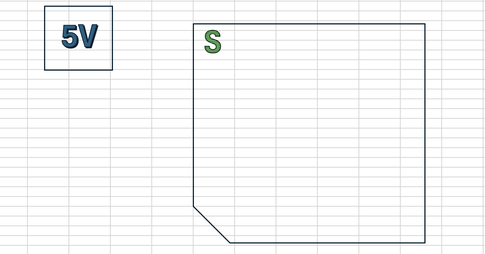


## 2 June 2026

I guess today's task is to figure out the power and ground supply on the PCB board and see if it is safe to put the chip inside.

Will start by observing the cable I have here.

I see that the on the schematics, for example 1V8C_a and 1V8C_b supply, the Voltage from the voltage regulator VOUT should be connected to resistor R24 before it was fed to the monitor punch hole and system, but now it seems there is no resistor to connect it.

But also on the schematics, it says solderswipe, I think we need to connect it using solder.

Okay, I just made one simple solder at R23, and now we can actually observe 3.3 V at the punch hole now, it kinda proves my thought...

Since Steve is coming tomorrow, I will leave that to him.

## 3 June 2026

We have disconnected the Ferrite bead necessary to power the BANK 35 of XEM7310 with 2.5V.

All the necessary solder swipe has been connected, so that the power and ground can be supplied to the chip.

The orientation for the chip to the socket has also been confirmed.

But as we try to put the chip into the socket, we found out that the chip will not fit the way we planned.

After some digging, it has been found out that the JLCC44 package for the chip we had on our hand is having a different mechanical definition with the socket.

From the [document](https://europractice-ic.com/wp-content/uploads/2019/06/CD_JLCC44.pdf), it can be seen that from its pin 1 and go counter-clockwise, the first corner should be "less cut out".

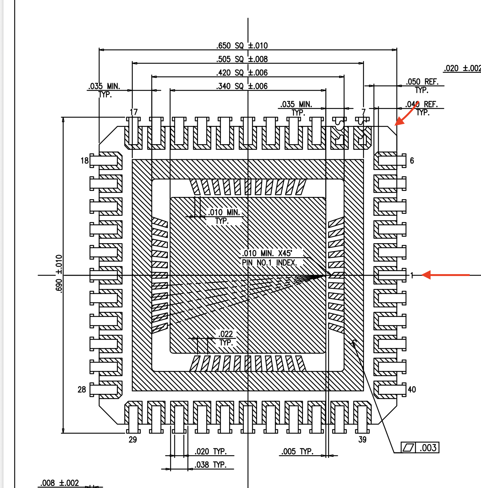

But the socket we have is defined in a way where this triangular corner appears at the 3rd corner after pin 1

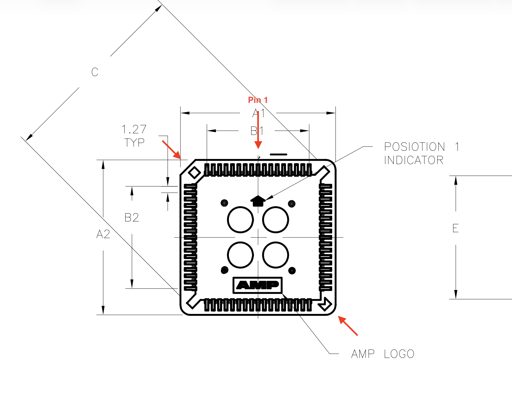

This inconsistency has caused the fact that our chip cannot fit properly.

As a solution, the corner for the socket has been cut out so that our chip can properly fit in.

Because we could not rotate the chip around when pins on the PCB have been defined and routed.

Now we shall proceed the test, and it appears that the LED can be lit when powered on, which means it is not short.

When I hook up the board, it appears that D2 is always lit.

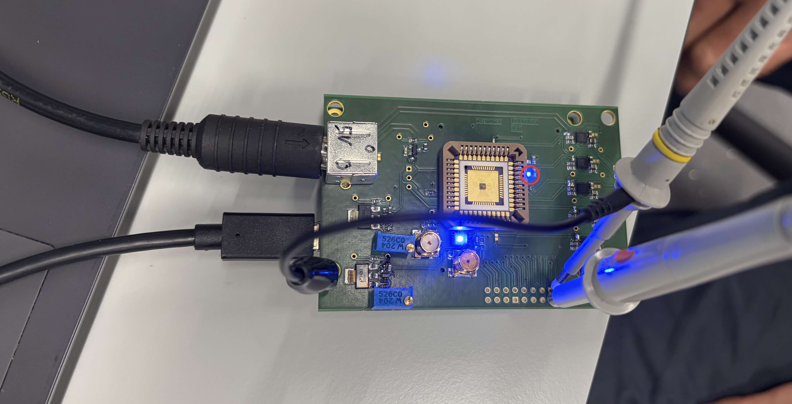

And after we check the testing PCB schematic, we found out that it indicates TCKO is "on".

After hooking up to the oscilloscope, we observed a nice clean 20MHz clock.


And under the default boot up setting, PLL will be configured as in the test mode.

So we would have:

```text

INPUT:

TEST = 1
TCKI = 5 - 20 MHz
PLL_NMSX_sel = 'X'
FREF = 'X'
FRANGE = 'X'
PLL_PDN = 'X'


OUTPUT:

CKOUT = FREF
TCKO = (16/16)*TCKI
```

In the functional mode, we should have:

```text
INPUT:

TEST = 0
TCKI = 'X'
PLL_NMSX_sel = '1'
FREF = 5- 20 MHZ
FRANGE = '1'
NS/MS = 16
PLL_PDN = '1'

OUTPUT:

CKOUT = (N/M)*FREF
TCKO = CKOUT/16
```

Preliminary testing with very limited configuration so far proves 2 things:

PLL is working!
My side of scan chain works!
Steve's side scan chain works!

Now I will need to write a new testing OpalKelly firmware to sort out my side of scan chain and also Steve's side of scan chain.

We now had the digital logic analyser hooked up to the test PCB, and we have the following pin-out:

```
    Logic analyser                      Chip pin name
        D0                                   clk_LVDS 
        D1                                   TCKO 
        D2                                   SDO 
        D3                                   FRANGE 
        D4                                   NMSX_SEL 
        D5                                   PLL_PDN
        D6                                   PLL_FREF_TCK 
        D7                                   PLL_TEST 
        D8                                   SE 
        D9                                   NMSX_TCK 
        D10                                  SDI 
        D11                                  data0
        D12                                  samhold 
        D13                                  ctrlB 
        D14                                  clk_config 
        D15                                  LVDS_ser_data_ctrl
```

## 4 Jun 2026

**Boot-Up Test**

To organise the observations from yesterday’s testing session, I performed a more thorough investigation and documented the expected behaviour alongside the measured results.

### Initial power-up condition

At boot-up, the following default values were observed:

```
ok_scan_in = 0
rstn_ok = 1
pll_pdn = 1
pll_test = 1
frange = 1
pll_nmsx_sel = 1
lvds_ser_data_ctrl = 1
ctrlB = 1
```

### Expected PLL behaviour

Since pll_test = 1, the PLL should operate in test mode, meaning:

```
TCKO = TCKI = FREF = 20 MHZ.
```

### Expected Scan Chain State

Since lvds_ser_data_ctrl = 1, all flops in Steve’s scan chain design should be loaded with logic 1:


```
data_LVDS --> ctrlA --> EN --> RS --> rst_n --> LVDS_set<1> --> LVDS_set<0> --> rst_n_pll
```

So we would have ctrlA = 1 and also ctrlB = 1, which should produce the following results input to LVDS:

```
D_LVDS = (ctrlA+cnt_mux)ctrlB = 1
```
As a result, the expected LVDS output is:
+ P = 1 
+ N = 0

This matches the observed behaviour:

* P (yellow trace) = 1
* N (green trace) = 0


### Logic Analyser Measurement

From the logic analyser, the following signals were captured::

```
clk_LVDS = PLL_FREF_TCK = NMSX_TCK = 20MHz
TCKO = 20 MHz
SDO = 0
FRANGE = 1
NMSX_SEL = 1
PLL_PDN = 1
PLL_TEST = 1
SE = 0
SDI = 1
ctrlB = 1
LVDS_ser_data_ctrl = 1
```
These measurements are consistent with the expected boot-up configuration.

### LVDS voltage levels

But the voltage we observed is not what I think it should be, like **1.375** and **1.025**. What we observed is about 3.1 V and 0 V.

#### Expected LVDS voltage levels

The expected LVDS common-mode voltages would be approximately:
```
P ≈ 1.375 V
N ≈ 1.025 V
```
corresponding to a differential voltage of approximately:

```
VP - VN ≈ 350 mV
```
#### Measured voltage levels

Instead, the measured voltages were approximately:

```
P ≈ 3.1 V
N ≈ 0 V
```
#### Functional verification

To verify that the LVDS driver was responding correctly, ctrlB was toggled from 1 to 0.

The outputs flipped polarity as expected:

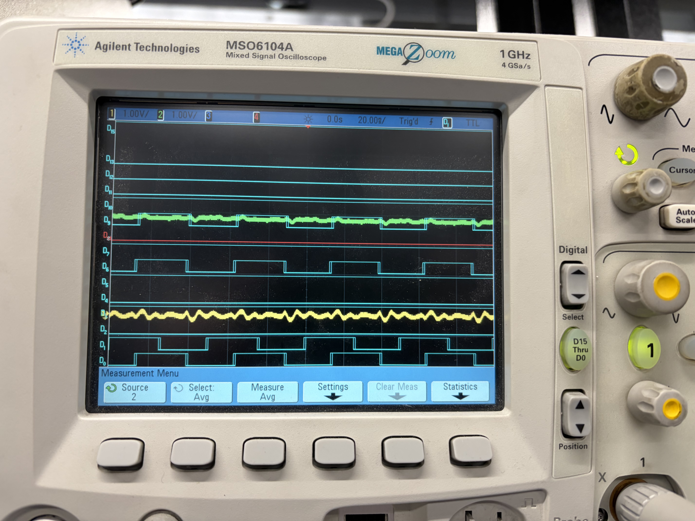

```
ctrlB = 1  →  P = 1, N = 0
ctrlB = 0  →  P = 0, N = 1
```
This suggests that the LVDS logic and driver are functioning correctly.

#### Possible cause of the Voltage level❓❓❓❓❓❓

The voltage levels may appear incorrect because the LVDS output is not terminated.

According to the LVDS standard, a termination resistor should be placed between the differential pair:

$$R_{TERM}=100\Omega$$

This resistor allows the LVDS driver current (typically 3.5 mA) to generate the expected differential voltage:

$$V=IR=3.5\,mA\times100\Omega=350\,mV$$

However, during measurement the outputs were probed directly using an oscilloscope. Each probe presents a very high input impedance (approximately 10 MΩ), effectively leaving the LVDS outputs unterminated.

As a result, the observed voltages may not represent the true operating levels of the LVDS interface.

**Change the PLL test case**

Next, I attempted to switch the PLL from test mode into functional mode.

### Procedure

1. Reset the PLL:

```
pll_pdn = 0
pll_test = 0
```

As expected, TCKO stopped toggling.

2. Re-enable the PLL and deselect pll_nmsx_sel to use the default N/M divider values.

The default PLL configuration should generate a 300 MHz clock:

$$f_{PLL}=20\times\frac{15}{1}=300\,MHz$$

Since TCKO outputs CKOUT/16, the expected output frequency is:

$$f_{TCKO}=\frac{300}{16}=18.75\,MHz$$

The resulting configuration was:
```
ok_scan_in = 1
rstn_ok = 1
pll_pdn = 1
pll_test = 1
frange = 1
pll_nmsx_sel = 1
lvds_ser_data_ctrl = 1
ctrlB = 1
```
### Results

The measured output matched expectations:


```
TCKO = 18.75 MHz
```

This confirms that the PLL can lock and operate using the default divider values.

Unfortunately, due to limitations in the current firmware (specifically, the inability to directly control Steve’s scan chain), further PLL testing could not be performed at this stage.

TO BE CONTINUED!!!

**Scan chain test**

The next objective was to verify the operation of the scan chain.

### Test procedure

1. Disable the PLL:

```
pll_pdn = 0
```
2. Drive a logic 1 onto SDI via the ok_scan_out signal.
3. Perform repeated scan-shift operations.

### Results

After 11 scan shifts, the LED connected to SDO illuminated.

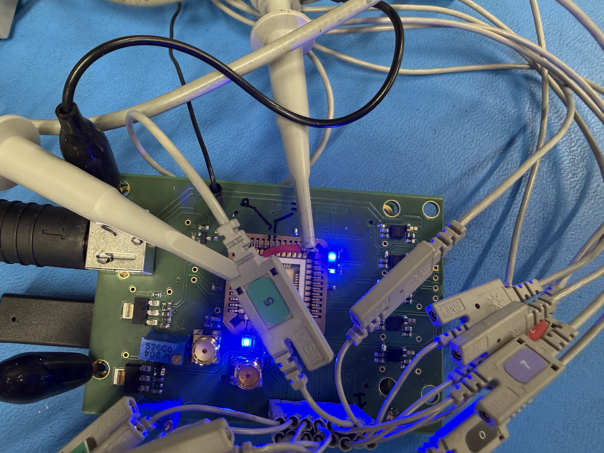

This confirms that the scan chain is capable of shifting data from SDI to SDO.

Although I am not yet certain whether the expected chain length should be exactly 11 bits, the experiment demonstrates that the scan chain is operational.

Further verification will be carried out once updated firmware becomes available.

### Summary

Confirmed

* Boot-up configuration matches design expectations.
* LVDS output logic responds correctly to ctrlB.
* PLL test mode produces a 20 MHz TCKO.
* PLL functional mode produces an 18.75 MHz TCKO.
* Scan chain successfully shifts data from SDI to SDO.

Outstanding Questions

* Why are the observed LVDS voltage levels significantly different from expected LVDS levels?
    * Most likely due to lack of differential termination.
    * Requires testing with a 100 Ω termination resistor across P and N.
* Exact scan chain length remains to be verified.
* Additional PLL testing awaits updated firmware support.


## 8 Jun 2026

I will proceed the design for new testing firmware, the following features should be included.

+ controllable scan chain for clk_LVDS and LVDS_ser_data_ctrl
+ Self customised N/M value on my scan chain

I think I will have to set LVDS_ser_data_ctrl as WireIn but clk_LVDS as TriggerIn so it can shift by command.


